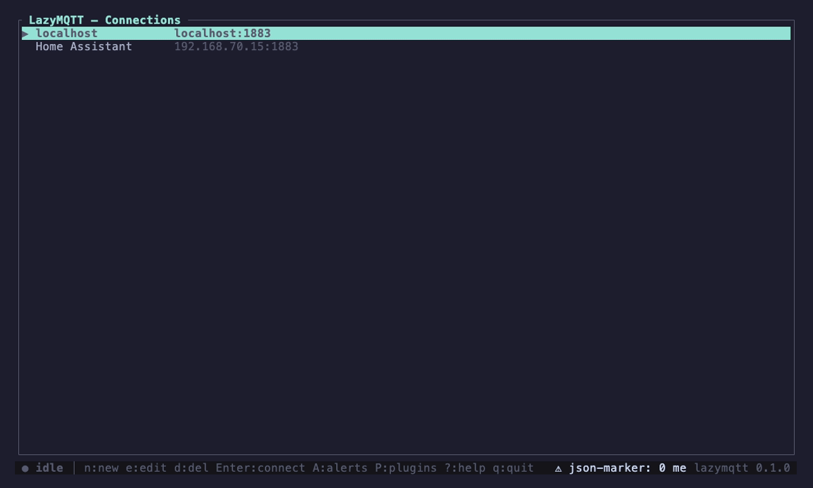
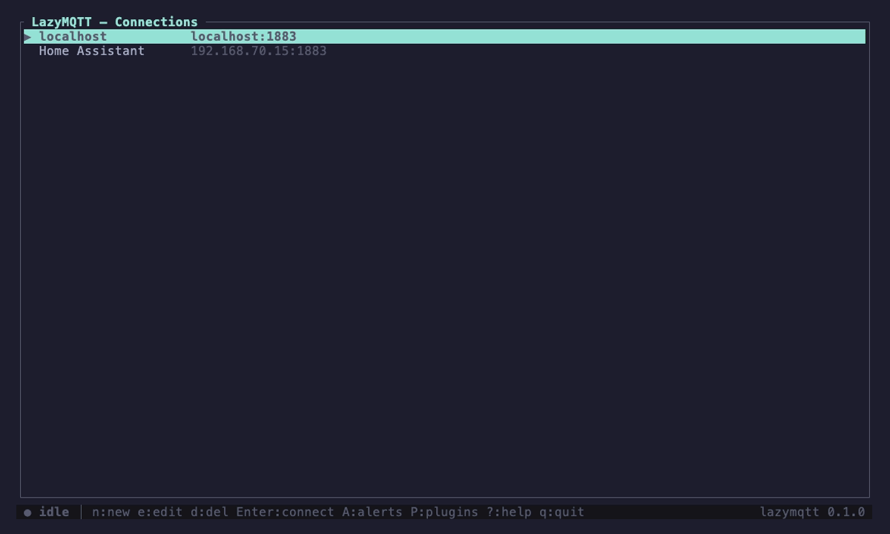
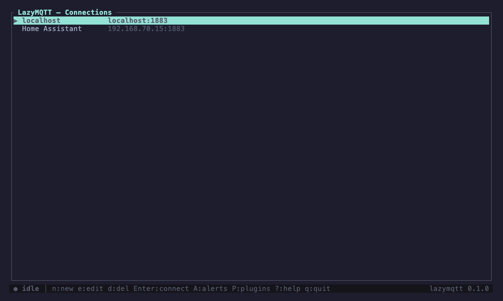
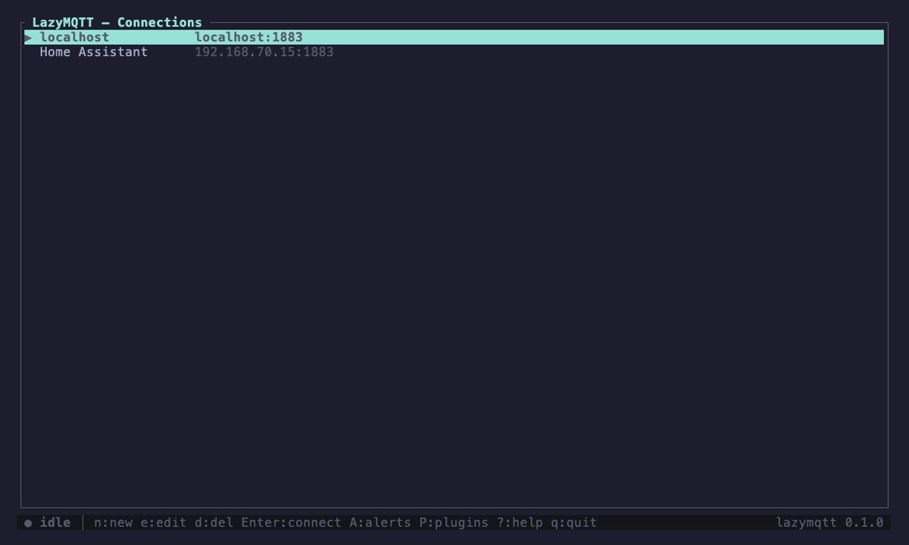

# LazyMQTT

A fast, terminal-UI MQTT client written in Rust — inspired by [MQTT Explorer](https://mqtt-explorer.com/), but keyboard-driven and living in your terminal.


> Core browsing, inspecting, and publishing — no plugins. The plugins have their
> own demos [below](#plugins).
>
> All demos are scripted with [VHS](https://github.com/charmbracelet/vhs);
> regenerate one with `vhs assets/<name>.tape` (see each tape header for
> prerequisites).

## Features

- **Saved connections** — create, edit, and delete broker profiles (host, port, client ID, credentials, TLS). Persisted to disk as JSON.
- **Per-connection subscriptions** — store the topics each connection subscribes to on connect (comma-separated, wildcards supported: `sensors/#`, `home/+/temp`).
- **Live topic tree** — incoming messages are aggregated into a collapsible hierarchy split on `/`, with per-node message counts and last-value previews (the signature MQTT Explorer view).
- **Message inspector** — a **Payload** pane for the selected message and a **History** pane of every message on the topic (timestamp, QoS, retain flag, expandable inline). Either sub-pane can be collapsed so the other fills the space.
- **Publish** — send messages to any topic with QoS 0/1/2 and an optional retain flag.
- **Clear retained messages** — drop a broker's retained message on the selected topic (with confirmation).
- **Copy & paste** — keyboard text selection in the Payload/History panes yanks to the system clipboard; paste into any input field.
- **Theming** — pick a built-in preset (Default, Dracula, Nord, Gruvbox Dark, Solarized Dark) or set each color yourself, with live preview; saved to your config.
- **Plugins** — an in-process plugin system observes the message stream and annotates, re-renders, or acts on it. Built-ins: a JSON-validity marker, a JSON pretty-print view, per-connection topic alerts, and a traffic recorder/replayer. Enable/disable per plugin (persisted).
- **Fast** — async `rumqttc` event loop feeding a non-blocking `ratatui` render loop; release build is LTO-optimized and stripped.

## Install

**Homebrew** (macOS & Linux):

```bash
brew tap scottfelder/lazymqtt
brew trust scottfelder/lazymqtt   # Homebrew requires trusting third-party taps
brew install lazymqtt
```

> The `brew trust` step is a Homebrew policy for all third-party taps, not
> specific to lazymqtt — Homebrew refuses to load a tap's formula until you
> trust it once.

**Cargo** (any platform with a Rust toolchain):

```bash
cargo install lazymqtt
```

**Prebuilt binaries** for macOS (Apple Silicon & Intel) and Linux x86-64 are
attached to each [GitHub Release](https://github.com/ScottFelder/lazymqtt/releases).

`lazymqtt --version` prints the installed version; `lazymqtt --help` shows usage.

## Build & Run

Requires a Rust toolchain (`rustup`, stable).

```bash
cargo run            # debug
cargo build --release && ./target/release/lazymqtt   # optimized
cargo test           # unit tests
```

Config lives in `~/.config/lazymqtt/` on both macOS and Linux (or
`$XDG_CONFIG_HOME/lazymqtt/` if that's set) — `connections.json` for broker
profiles, `theme.json` for colors, and `plugins/` for plugin state. On first
run, config from the old macOS location
(`~/Library/Application Support/dev.lazymqtt.lazymqtt/`) is moved here
automatically.

Each connection uses a unique client id at runtime (`<your-id>-<random>`) so two
instances (or a leftover) never collide on the broker.

## Keybindings

**Connections**
| Key | Action |
|-----|--------|
| `j`/`k` or ↑/↓ | move |
| `Enter` | connect |
| `n` · `e` · `d` | new · edit · delete |
| `P` | plugins · `?` help · `q` quit |

**Connection form**
| Key | Action |
|-----|--------|
| `Tab` / ↑↓ | switch field |
| `space` | toggle TLS |
| `Enter` · `Esc` | save · cancel |

**Broker — Topics pane** (`1`)
| Key | Action |
|-----|--------|
| `m` | command menu — core commands + a submenu (`▸`) per plugin; scroll + Enter, `→`/`←` descend/back |
| `j`/`k` or ↑/↓ | move in tree |
| `Enter` | expand/collapse · `→` expand · `←` collapse |
| `Tab` | cycle panes · `1`/`2`/`3` focus Topics/Payload/History |
| `s` · `u` | subscribe · unsubscribe (selected) |
| `p` · `r` | publish · clear retained (selected) |
| `x` · `c` | clear selected topic (from view) · clear tree |
| `A` · `S` | alert rules · JSON schemas |
| `R` | recordings (replay/edit/rename/delete) |
| `T` · `P` · `?` | theme · plugins · help |
| `Esc` · `Ctrl-q` | disconnect · quit |

**Broker — Payload (`2`) / History (`3`) panes**
| Key | Action |
|-----|--------|
| `hjkl` or ↑/↓/←/→ | move the text cursor |
| `v` · `y` | start/extend selection · yank to clipboard (whole line if no selection) |
| `Esc` | clear selection |
| `z` | collapse/expand the focused pane (the other fills the space) |
| `i` | cycle Payload view (raw ↔ plugin views, e.g. JSON) |
| `Enter` (History) | expand/collapse the entry under the cursor |

**Plugins screen** (`P`)
| Key | Action |
|-----|--------|
| `j`/`k` | move |
| `space`/`Enter` | toggle enabled |
| `Esc` | close |

## Plugins

Plugins are compiled into the binary and run in-process. They observe events
(message received, connect/disconnect, tick, …) and respond with actions
(annotate a message, publish, subscribe, show a status), supply an alternative
Payload rendering, or own a whole pane (a dashboard) — without touching
connection state or the terminal directly. Every plugin is **disabled by
default**; enable the ones you want on the Plugins screen (`P`). The choice
persists in `plugins/config.json`.

Built-in plugins, each with its own demo:

**json-marker** — flags whether each payload is valid JSON (annotation).



**json-view** — pretty-prints JSON payloads (syntax-colored) as an alternate Payload view (`i`).


**xml-view** — pretty-prints XML payloads (syntax-colored) as an alternate Payload view (`i`). The Payload pane auto-selects the matching structured view per payload (JSON → json-view, XML → xml-view); `i` toggles raw ↔ that view, and the choice sticks as you move between messages.

**protobuf-view** — decodes **binary protobuf** payloads into named fields as an alternate Payload view. Because the wire format carries no field names or types, you map topics to a `.proto` + message type **per connection** (edited in-app with `B`); the `.proto` is compiled at runtime (pure-Rust, no `protoc`) and matching payloads auto-decode to a syntax-colored field tree. Mapped topics whose bytes decode cleanly auto-select the `Protobuf` view; `i` toggles back to raw.

**topic-alerts** — raises alerts (annotations + status) from **per-connection** rules, including numbers pulled from a JSON field.


**json-schema** — validates each message against a **per-connection** JSON Schema mapped by topic filter, annotating it valid (✓) or invalid (✗, with the failing path) and flagging the failure in the status bar. Edit mappings in-app with `S`.



**publish-templates** — saved topic/payload/QoS/retain presets. Each appears in the `m` menu; picking one opens the publish form pre-filled so you can tweak `{{placeholders}}` and review before sending. Save the current publish form as a template with `^T`.


**payload-generator** — publishes synthetic payloads for exercising subscribers: counters, random values, timestamps (optionally wrapped in a JSON `template`). Each generator is an `m`-menu command; a one-shot publishes once, a streaming generator (`interval_ms`) toggles on/off and fires at its rate. Configured in `plugins/generators.json`.



**traffic-analytics** — a live stats dashboard in its own pane (open "Traffic analytics" from the `m` menu): message rate + peak with a sparkline, total/throughput, QoS mix, retained share, and a busiest-topics bar chart. Updates every frame; resets per connection.



**topic-recorder** — records the connection's traffic to a file and replays it back to the broker, preserving timing; a picker (`R`) replays/renames/deletes individual recordings.


Plugins that expose commands appear in the `m` menu as their own submenu
(a `▸` row per plugin — `Enter`/`→` opens it, `Esc`/`←` goes back). The recorder
submenu, for example, has **Start/Stop recording**, **Replay newest recording**, and
option cyclers for **loop**, topic **prefix** (`replay/` on/off), and **speed**
(1x / 2x / 5x). Option rows are marked `‹ ›` and cycle in place with the
left/right arrows (or `h`/`l`), leaving the menu open. Recordings are written
per connection as JSON Lines to
`plugins/recordings/<connection-id>-<timestamp>.jsonl` (one message per line with
a relative `offset_ms`); **Replay newest** plays back the latest recording for
the active connection. By default replay republishes under a `replay/` topic
prefix so it never clobbers live topics, and recording pauses during replay so
the plugin doesn't capture its own echoes.

To pick a specific recording, open the **recordings picker** with `R` (or the
"Recordings" command in the `m` menu). It lists the active connection's
recordings, newest first, with their message counts: `Enter` replays the
selected one, `e` edits it, `r` renames it (in place), and `d` deletes it.

`e` opens a **multi-line editor** on the recording's contents — one JSON message
per line (`{"offset_ms":…,"topic":…,"payload":…,"qos":…,"retain":…}`), so you can
tweak payloads, retime, add, or drop messages before replaying. Arrow keys move
the cursor, `Enter` splits a line, `^S` saves over the current recording, and
`^N` "save as" writes the edits to a new recording (leaving the original
untouched). Saving validates every line as JSON and points at the first bad line
if any, so a recording never gets corrupted.

Alert rules are **per connection** and edited in-app: press `A` (from
Connections or Broker) to open the rules editor — `a` add, `e` edit, `d` delete.
They're stored at `plugins/alerts/<connection-id>.json` and loaded when that
connection connects.

A rule's condition (`when`) is `above` / `below` (with `value`), `changed`, or
`silent` (with `seconds`). For numeric comparisons an optional JSON `field`
extracts a value from the payload — a dot-separated path that nests into objects
and indexes arrays (e.g. `data.sensors.0.temp`); without it the whole payload is
used. JSON numbers and numeric strings (`"85"`) both work. Severity is `warn`
(default) or `error`. Alerts are visual only — no commands are run.

JSON Schemas are also **per connection**, edited in-app: press `S` (from
Connections or Broker) for the schema list — `a` add, `e` edit, `d` delete. The
form has a topic-filter field and a multi-line JSON editor for the schema body
(`Tab` switches between them, `^S` saves); saving validates the JSON. They're
stored at `plugins/schemas/<connection-id>.json` (also hand-editable) as a list
of `{ "topic": "<filter>", "schema": { … } }` mappings; a message is validated
against the first mapping whose topic filter matches. The validator covers a
practical subset of JSON Schema — `type` (incl. `integer` and arrays of types),
`required`, `properties`, `items`, `enum`, `const`,
`minimum`/`maximum`/`exclusiveMinimum`/`exclusiveMaximum`,
`minLength`/`maxLength`, `minItems`/`maxItems` — and ignores keywords it doesn't
recognize.

See `FEATURES.md` for the plugin roadmap (message-transform pipeline, ecosystem
decoders, external-process/WASM loading, …).

## Theming

Open the theme editor with `T` (or the "Theme" entry in the `m` menu). The top
of the list is a set of built-in presets — **Default**, **Dracula**, **Nord**,
**Gruvbox Dark**, **Solarized Dark** — and below them is every color role the UI
uses (accent, dim, text, the severity colors, the JSON syntax colors, the status
bar background, …), each with a live swatch.

- `Enter` on a preset applies it; `Enter` (or `e`) on a color role edits it —
  type a color name (`cyan`, `red`, `default`, …) or a `#rrggbb` hex value.
- Changes apply live across the whole app and are **saved automatically** (no
  separate save step; `s` re-saves if you want the reassurance).

Your theme is stored at `~/.config/lazymqtt/theme.json` as a `role → color` map,
so it's hand-editable too. With no file, the Default theme is used.

## Quick test

```bash
# public test broker
Name: Test  Host: test.mosquitto.org  Port: 1883  Topics: #
```

## Project layout

```
src/
  main.rs      entry point, terminal + async render/input loop
  app/         application state (App) + behavior, one module per concern
               (screen/view/forms/textarea types; connection/commands/broker/
                alerts/schemas/recordings/theme logic)
  ui/          ratatui rendering, one module per screen (+ common widgets)
  events/      keyboard/paste handling, one module per screen
  config.rs    connection/subscription persistence
  paths.rs     config dir resolution (~/.config/lazymqtt) + legacy migration
  theme.rs     color theme model, presets, and theme.json persistence
  mqtt.rs      async MQTT client task + event/command channels
  tree.rs      hierarchical topic tree
  plugin/      in-process plugin API, host, and built-in plugins
    mod.rs       Plugin trait + PluginHost
    api.rs       event/action/annotation/inspector types
    config.rs    per-plugin enable/disable persistence
    schemas.rs / alerts_rules.rs / recordings.rs / templates.rs /
    generators.rs / topics.rs   shared models + validators + topic matching
    builtin/     bundled plugins (json-marker, json-view, xml-view,
                 protobuf-view, topic-alerts, json-schema,
                 publish-templates, payload-generator,
                 traffic-analytics, topic-recorder)
                 + jsonfmt (shared JSON → styled-span colorizer)
```

## Contributing

Contributions are welcome — bugs, features, docs, and plugins. See
[CONTRIBUTING.md](CONTRIBUTING.md) for the dev setup, the checks CI expects
(`fmt` / `clippy` / `test`), and the pull-request workflow.

## License

MIT
